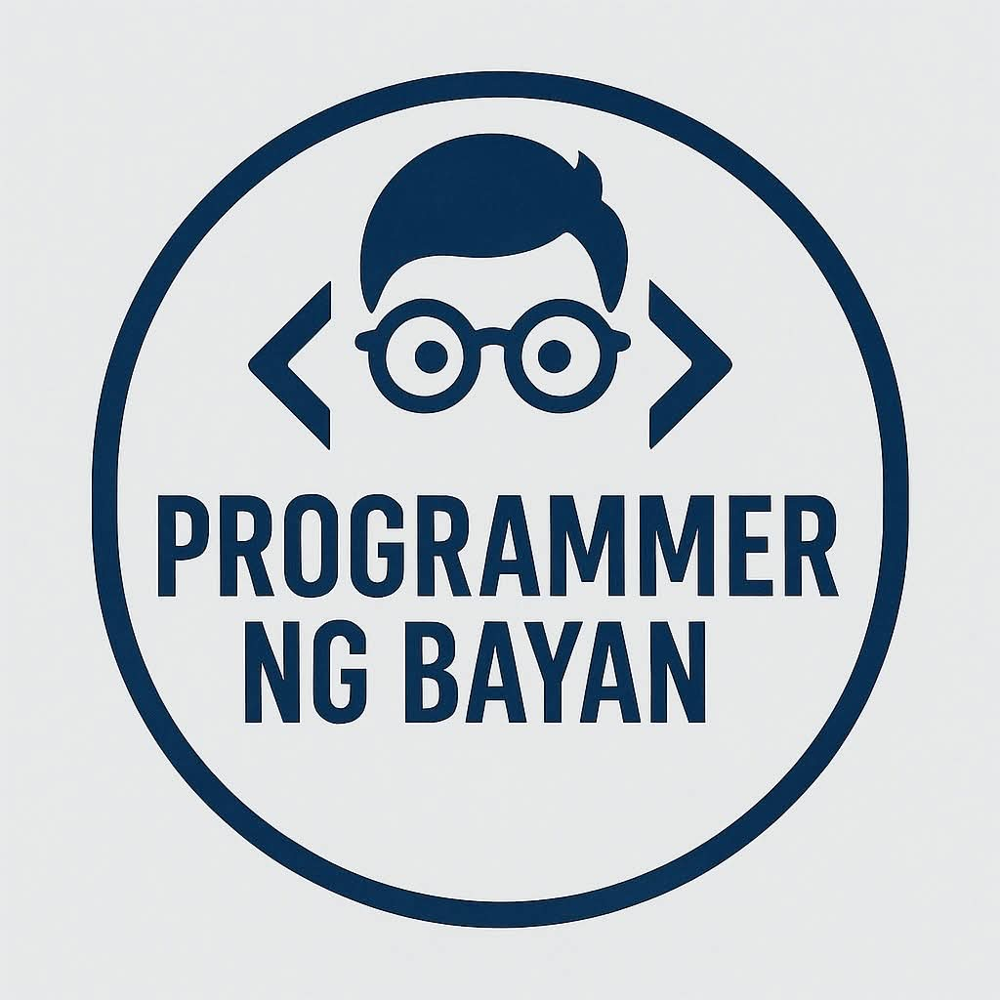

  

<h1 align="center">Programmer Ng Bayan</h1>

  <em>Your Complete Tech Solutions Partner. 
  We bring your innovative ideas to life.</em>

---

## 🌐 About Us

**Programmer ng Bayan** is your trusted partner in innovation—offering services from **Arduino and IoT projects** to **custom software development**, **system integration**, and **expert consultation**.  
We are dedicated to turning ideas into powerful digital solutions tailored to your needs.

---

## 💼 Our Services

-   🌍 **Web Development** — Scalable and modern web solutions using Laravel, React, and TailwindCSS.
-   📱 **Mobile Development** — Cross-platform mobile apps for Android and iOS.
-   ⚙️ **Arduino & IoT Development** — Smart systems and hardware integration.
-   🧠 **System Integration & Consultation** — Streamlined IT solutions and expert tech advice.

---

## 🧩 Tech Stack

| Framework / Tool | Description                                           |
| ---------------- | ----------------------------------------------------- |
| **Laravel**      | Backend framework for robust server-side applications |
| **React**        | Frontend library for interactive UIs                  |
| **Tailwind CSS** | Modern, utility-first CSS framework                   |
| **JavaScript**   | Dynamic scripting for client and server logic         |
| **npm**          | Package management for frontend dependencies          |
| **Vite**         | Lightning-fast build tool for modern web projects     |

---

## 👥 Our Team

| Member                    | GitHub                                           | Image                                                                                             |
| :------------------------ | :----------------------------------------------- | :------------------------------------------------------------------------------------------------ |
| **Ahadon B. Caraing Jr.** | [@Ahadon13](https://github.com/Ahadon13)         |      |
| **Mikey**                 | [@Mikey1823](https://github.com/Mikey1823)       |     |
| **Torbuloloy**            | [@torbuloloy](https://github.com/torbuloloy)     |    |
| **Batawana Code**         | [@batawanacode](https://github.com/batawanacode) |  |
| **JP**                    | [@jp319](https://github.com/jp319)               |         |

---

## 📞 Contact Us

📧 **Email:** [programmerngbayan@gmail.com](mailto:programmerngbayan@gmail.com)  
📱 **Phone:** +63 995 510 9612  
📍 **Address:** Purok 3G, RTU Apokon, Tagum City, Davao del Norte, Philippines, 8100  
🌐 **Facebook:** [Programmer ng Bayan](https://www.facebook.com/people/Programmer-ng-Bayan/61574749689977/)

---

## 🧠 Mission

To empower individuals, businesses, and communities through innovative and accessible technology solutions.

## 💬 Vision

To be recognized as the go-to tech partner in the Philippines for software, IoT, and digital transformation services.

---

  <strong>© 2025 Programmer Ng Bayan</strong> 
  Building smart and scalable solutions for everyone.

